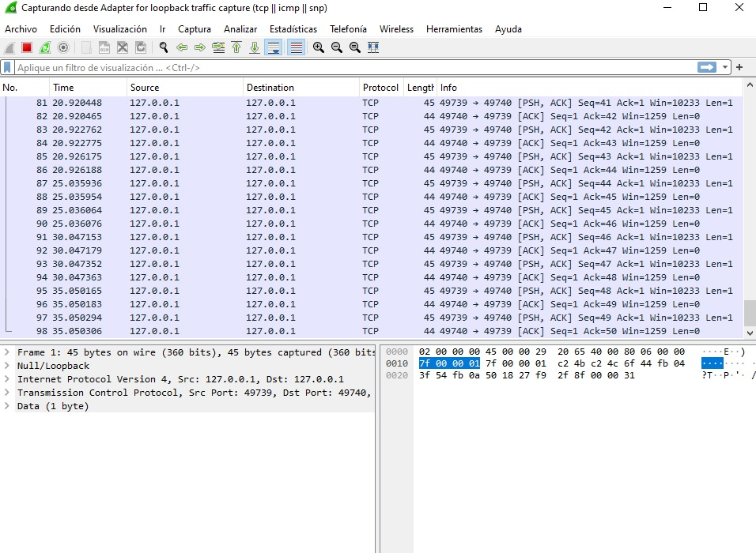
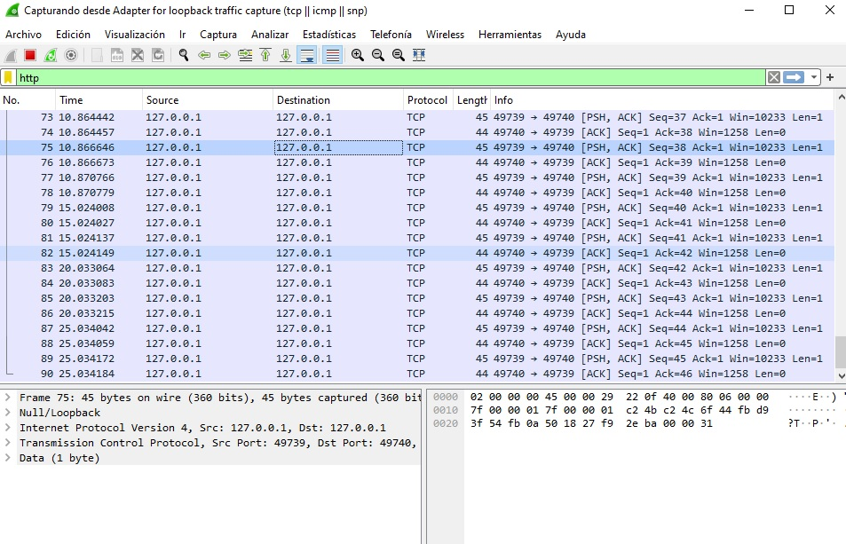
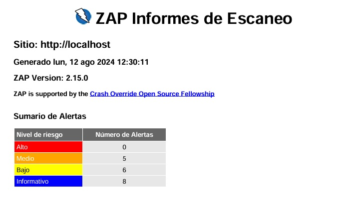

## ANALISIS REALIZADOS CON HERRAMIENTAS SUGERIDAS

nombre:Carlos Muñoz
analisis: pagina web Home Easy

En esta parte del documento se mostrarán capturas y análisis con herramientas como WIRESHARK, NMAP, AUTOPSY, FTK O SIFT para identificar si hay alguna anomalía 

Se aplicó análisis con wireshark a protocolo "HTTP" puerto 80 y no mostro resultados anómalos
 
 

 
 

 

 
 

 Se realizó escaneo a la ip 127.0.0.1 con nmap y no mostro anomalías visibles 

 
 

 
 

 
 </p

 en este escaneo se identificaron vulnerabilidades que podrian ser explotadas y que hay que validar para futuros ataques