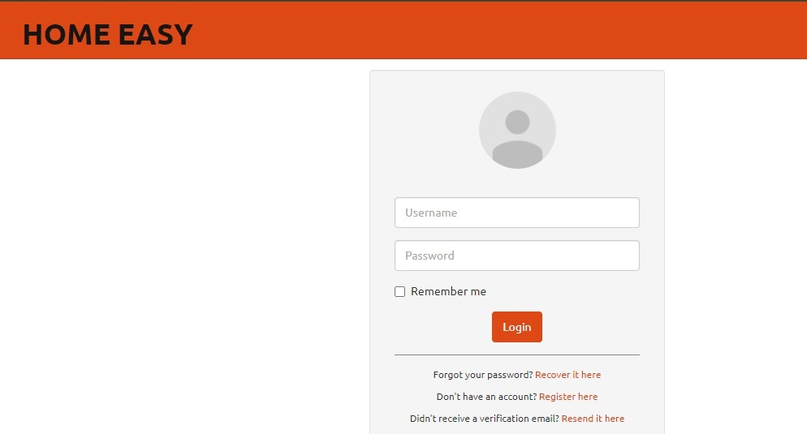
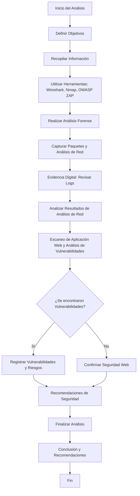

# INFORME DE ANALISIS HOME EASY

Nombre: Carlos Muñoz

Cargo: administrador sitio web

Fecha: 12-8-2024

## Resumen ejecutivo
Este informe tratara sobre un analisis realizado a nuestra web HOME EASY, el cual es un analisis preventivo para validar que nuestra web no fue afectada, se realizara una variada cantidad de escaneos y con el resultado de estos se daran recomendaciones para mitigarlos

## Introducción
Home Easy, es una empresa relativamente nueva en el área, dedicada al presupuesto y posterior venta de diferentes tipos de hormigón por metro cubico. El objetivo de este analisis es revertir inmediamente el daño si es que fue causado y si no realizar un escaneo preventivo

## Antecedentes del caso
Home Easy es una plataforma que presta servicios a clientes y gestiona presupuestos para proyectos. El fondo de conjunto de cooperacion Chile-Mexico ha sufrido un ataque durante la implementacion de una de sus infraestructuras criticas y por lo tanto es necesario un analisis profundo y recolectar la informacion de daño a nivel de ciberseguridad

## Objetivos del análisis
Realizar un analisis forense exhaustivo para identificar las vulnerabilidades explotadas, recolectar evidencia y determinar la extension del compromiso

## Metodología
Herramientas
Wireshark, Nmap, Owasp Zap

## Procedimientos
Utilizar Wireshark para capturar y analizar paquetes de red, detectar intrusos y ataques, actividad sospechosa.

Nmap para descubrir que hots estan activos en una red, escaneos de puertos para identificar que puertos estan abiertos y que servicios estan corriendo en cada puerto

Owasp Zap analizar el trafico entre el cliente y el servidor, detectar vulnerabilidades para que no sean explotadas 

## Hallazgos
Evidencia digital:no se encontraron anomalías en el log del sistema 

Análisis de red: el análisis de red demostró estar dentro de un rango de normalidad sin alteraciones significativas 

Análisis de sistema: se realizo un escaneo de la aplicacion web y mostro algunas vulnerabilidades que podrian ser explotadas

</p

## Conclusion

Tras una investigación y una variedad de testeos a la página web HOME EASY, se detectó una vulnerabilidad en una falta de actualización del  sistema de validacion, el ataque realizado al fondo conjunto de cooperacion Chile-Mexico por suerte no se extendio hasta nuestra web Home Easy, pero hay que tomar en cuenta que si existian vulnerabilidades en nuestra web Home Easy

## Recomendaciones
Aplicar frecuentemente actualizaciones y parches de seguridad

Ver la opción de obtener un firewall tipo hardware

Realizar escaneos de red de manera más frecuente

Mantener una red extra en caso de un nuevo tipo de ataque de este tipo no detener los servicios

Seguir validando falencias en nuestra web Home Easy 

