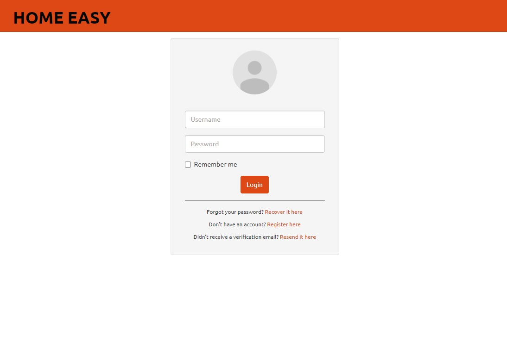
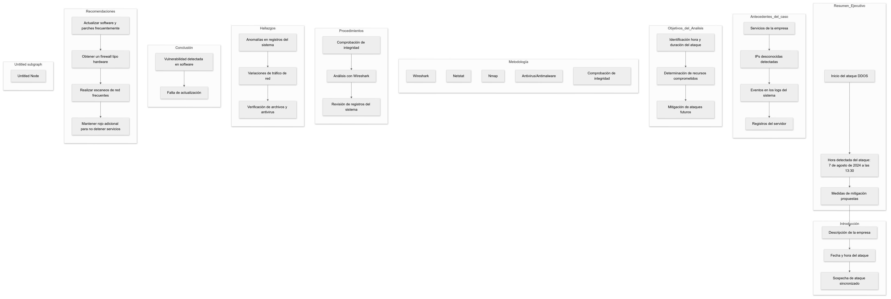

# INFORME DE ATAQUE DDOs

Nombre: Carlos Muñoz
Cargo: administrador sitio web
Fecha: 9-8-2024

## Resumen ejecutivo
Este informe tratara sobre un ataque de seguridad a la página web HOME EASY. A través de un análisis forense, se detectó que fue un ataque de denegación de servicios (DDOS), el cual permitió al atacante bajar los servicios de la página web, se logró verificar la hora del ataque y se propondrán medidas de mitigación 

## Introducción
Home Easy, es una empresa relativamente nueva en el área, dedicada al presupuesto y posterior venta de diferentes tipos de hormigón por metro cubico, el ataque fue realizado 7 de agosto de 2024 a las 1:30 de la tarde, se sospecha que el ataque fue de diferentes IP y un ataque sincronizado a nuestra web

## Antecedentes del caso
Home Easy es una plataforma que presta servicios a clientes y gestiona presupuestos para proyectos. Se detectaron varios inicios de sesión fallidos desde IP desconocidas y estos eventos se vieron en los logs del sistema del servidor

## Objetivos del análisis
Identificar la hora exacta del ataque 
Determinar el tiempo que estuvo nuestro servicio sin funcionar
Verificar si hubo más recursos comprometidos en el ataque
Mitigar ataques futuros y actuales de mejor manera

## Metodología
Herramientas
Wireshark, Netstat (comando para verificar las conexiones de red y detectar posibles conexiones sospechosas), Nmap y herramientas antivirus y antimalware para escaneo del sistema post ataque, integrity checking

## Procedimientos
Utilizar integrity checking para verificar la integridad de los archivos y directorios, análisis a través de Wireshark para inspeccionar paquetes y detectar patrones sospechosos, revisión de log del sistema 

## Hallazgos
Evidencia digital: se encontraron anomalías en el log del sistema desde hace 6 días anteriores al ataque

Análisis de red: el análisis de red demostró variaciones en el tráfico de red inusuales desde hace 5 días atrás exactamente

Análisis de sistema: se hizo un análisis de verificación de archivos del sistema y de antivirus y antimalware 

## Conclusión 
Tras una investigación y una variedad de testeos a la página web HOME EASY, se detectó una vulnerabilidad en una falta de actualización de software tanto a nivel de red como de sistema operativo

## Recomendaciones
Aplicar frecuentemente actualizaciones y parches de seguridad

Ver la opción de obtener un firewall tipo hardware

Realizar escaneos de red de manera más frecuente
Mantener una red de extra en caso de un nuevo tipo de ataque de este tipo, no detener los servicios

diagrama de flujo 

